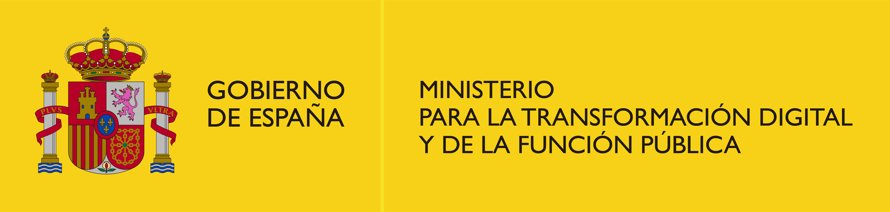
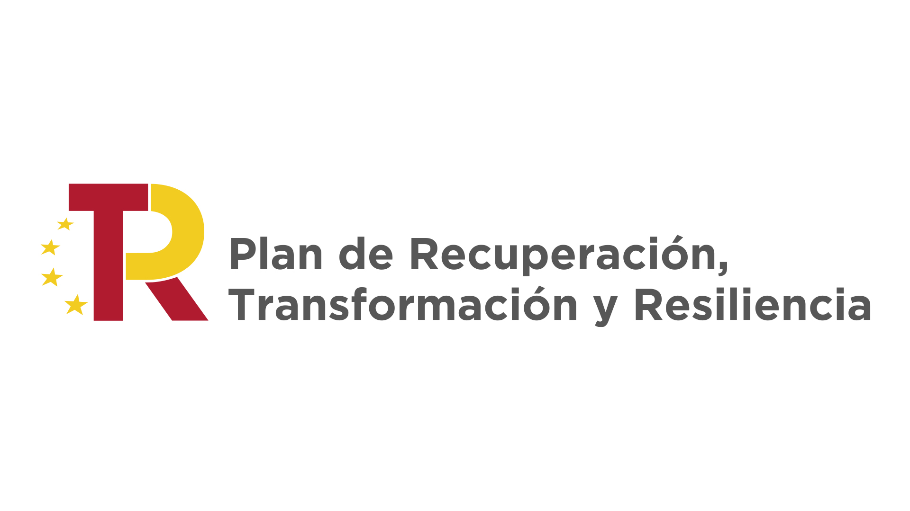
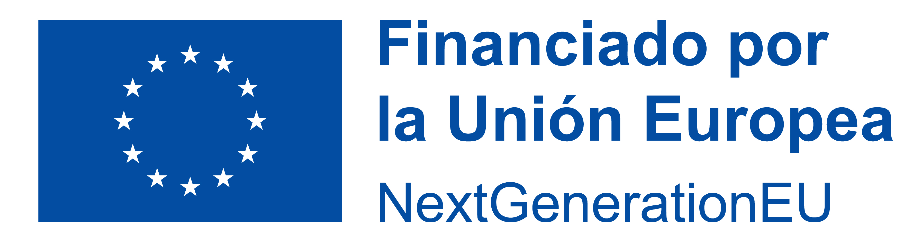
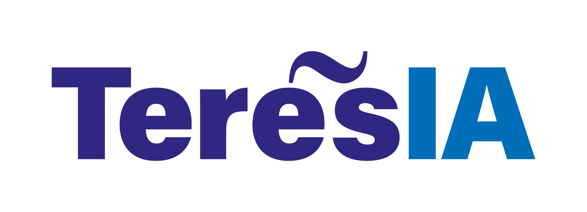

# TeresIA - Servidor BRAT para anotación jurídica

Este repositorio contiene materiales y configuraciones para visualizar y revisar en **BRAT** distintas capas de anotación jurídica desarrolladas dentro del proyecto **TeresIA**.

Incluye versiones de gold standards, materiales experimentales y distintas organizaciones de servidor empleadas durante el trabajo de anotación sobre los dominios laboral y tributario.

## Contenido del repositorio

- `gold_standard1/`: primera versión de anotaciones sobre el Estatuto de los Trabajadores.
- `gold_standard2/`: segunda versión de anotaciones, incluyendo materiales laborales y tributarios.
- `experimento1/`: material experimental de anotación.
- `server1/`: primera organización del servidor a partir de `gold_standard1`.
- `server2/`: segunda organización del servidor a partir de `gold_standard2`.
- `server3/`: tercera organización del servidor, con ajustes posteriores en la organización de materiales.

## Uso básico

El repositorio está pensado como base de trabajo para montar, revisar o consultar proyectos BRAT. Las carpetas `server*/` contienen estructuras preparadas para ser usadas en un entorno BRAT, aunque cualquier despliegue debe validar previamente rutas, permisos y configuración del servidor.

## Notas de mantenimiento

No todos los materiales tienen el mismo estado de consolidación. Las carpetas `gold_standard*`, `server*` y `experimento1/` deben tratarse como recursos funcionales o históricos del proyecto.

No conviene eliminar, ignorar o reorganizar datos de anotación sin revisión humana previa.

## Proyecto TeresIA

Este repositorio forma parte de **TeresIA**, proyecto de investigación centrado en tecnologías del lenguaje aplicadas al dominio jurídico español.

Este desarrollo forma parte de **TeresIA**, proyecto de investigación financiado con fondos de la **Unión Europea – Next GenerationEU/ PRTR**, a través del **Ministerio para la Transformación Digital y de la Función Pública**.

Más información: [https://proyectoteresia.org](https://proyectoteresia.org)

